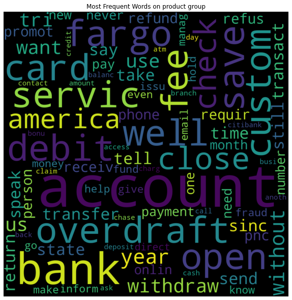

**WF Project**

Context: A customer service research unit within Wells Fargo approaches the NLP data science team with a request for help processing an industry-wide data source of customer complaints. Their goal is to rout the complaints to the proper research team based on product groupings. The business unit receives complaints in the form of free form text and wants to route the complaints to one of seven different departments (product_group name in the data in parenthesis):

* Bank account or service (bank_service)

* Credit card (credit_card)

* Credit Reporting (credit_reporting)

* Debt collection (debt_collection)

* Lines and loans (loan)

* Money transfers (money_transfers)

* Mortgage (mortgage) You have obtained a training dataset with 268,362 records that contains complaint text (text), a message identifier (complaint_id) and a verified correct complaint department (product_group).

**Task** : Your task is to use this training dataset to build a classification model to accurately route future complaints to the right department. Once you have developed your model, prepare a presentation (slide deck, notebook or similar) to share your model results as well as an overview and rationale of your methodology choices for data pre-processing, model selection and tuning and model evaluation. You will be given 72 hours to complete this task. We understand that this is not a lot of time to develop a high performing model, and you will therefore be judged on the soundness of your methodological choices as much or more than your model performance. The code used to produce your results, as well as your presentation materials and best trained model (as a model binary) should be turned in as part of your submission. Please be prepared to deliver a 30-45 minutes presentation to the hiring team over the phone at an agreed upon time following the case study.

